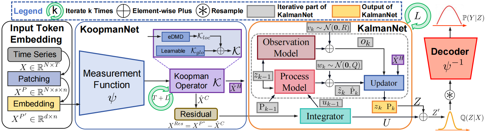
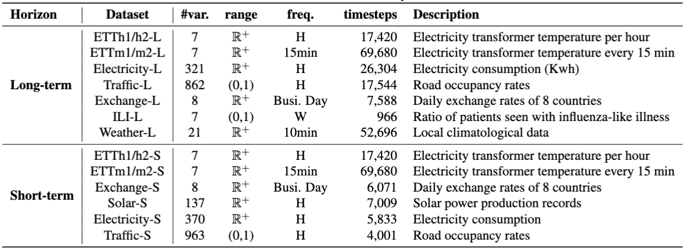
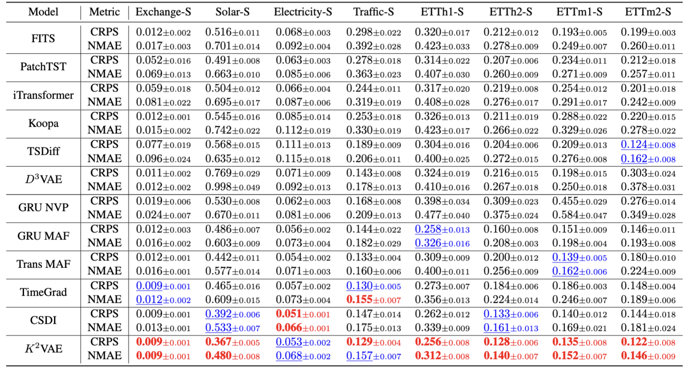
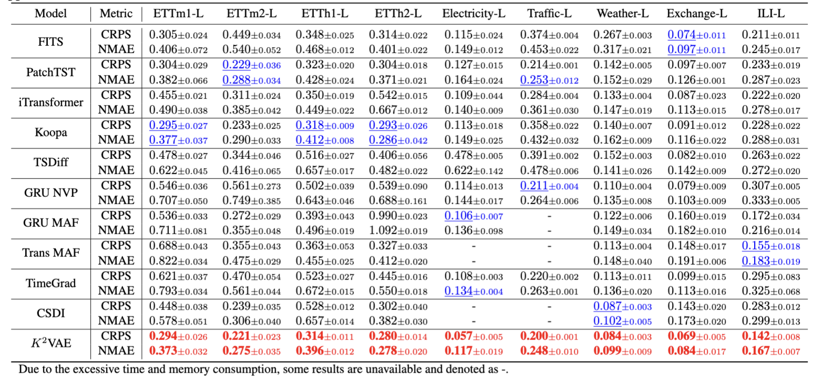

# K<sup>2 </sup>VAE: A Koopman-Kalman Enhanced Variational AutoEncoder for Probabilistic Time Series Forecasting

**This code is the official PyTorch implementation of our ICML'25  SpotLight Paper: K<sup>2 </sup>VAE: A Koopman-Kalman Enhanced Variational AutoEncoder for Probabilistic Time Series Forecasting**

[](https://arxiv.org/pdf/2410.12261)  [](https://www.python.org/)  [](https://pytorch.org/)    [](https://badges.pufler.dev/visits/decisionintelligence/K2VAE)

If you find this project helpful, please don't forget to give it a ⭐ Star to show your support. Thank you!

🚩 News (2025.5) K<sup>2 </sup>VAE  has been accepted as a **Spotlight** Poster by ICML 2025.

## Introduction :bulb:

We propose **K<sup>2 </sup>VAE**, an efficient VAE-based generative model that leverages a **KoopmanNet** to transform nonlinear time series into a linear dynamical system, and devises a **KalmanNet** to refine predictions and model uncertainty in such linear system, which reduces error accumulation in long-term forecasting.  Extensive experiments demonstrate that K<sup>2 </sup>VAE outperforms state-of-the-art methods in both short- and long-term PTSF, providing a more efficient and accurate solution.

<div align=center>  </div>


## Setup :wrench:

### Environment

K<sup>2 </sup>VAE is developed with Python 3.10 and relies on [PyTorch Lightning](https://github.com/Lightning-AI/lightning). To set up the environment:

```bash
# Create a new conda environment
conda create -n k2vae python=3.10
conda activate k2vae

# Install required packages
pip install .
pip uninstall -y k2vae # recommended to uninstall the root package (optional)
```

### Datasets

You can obtained the well pre-processed datasets from [GoogleCloud](https://drive.google.com/drive/folders/1l0c4H57xYKKQQ5Tm7kd4C8M2nCepky-y?usp=sharing) or [BaiduCloud](https://pan.baidu.com/s/1eyJvwnPx595nlJzYIzLAJA?pwd=0525). (This may take some time, please wait patiently.) Then place the downloaded data under the folder `./datasets`. 

- **Short-Term Forecasting**: 
    Configure the datasets using `--data.data_manager.init_args.dataset {DATASET_NAME}`. 
    
    ```bash
    ['exchange_rate_nips', 'electricity_nips', 'traffic_nips', 'solar_nips', 'etth1', 'etth2','ettm1','ettm2']
    ```
    
- **Long-Term Forecasting**: 
    Configure the datasets using `--data.data_manager.init_args.dataset {DATASET_NAME}` with the following list of available datasets:
    
    ```bash
    ['etth1', 'etth2','ettm1','ettm2','traffic_ltsf', 'electricity_ltsf', 'exchange_ltsf', 'illness_ltsf', 'weather_ltsf']
    ```
    *Note: You better explicitly specify the `context_length` and `prediction_length` parameters. For example, to set a context length of 96 and a prediction length of 192, use the following command-line arguments:*
    
    ```bash
    --data.data_manager.init_args.context_length 96 \
    --data.data_manager.init_args.prediction_length 192 \
    ```
- **Datasets Information**: 
<div align=center>  </div>


## Quick Start :rocket:

### Forecasting Configuration

For forecasting scenarios, use the following command:

```bash 
python run.py --config config/<stsf or ltsf>/<dataset>/k2vae.yaml \
                --data.data_manager.init_args.path /path/to/datasets/ \
                --trainer.default_root_dir /path/to/log_dir/ \
                --data.data_manager.init_args.dataset {DATASET_NAME} \
                --data.data_manager.init_args.context_length {CTX_LEN} \
                --data.data_manager.init_args.prediction_length {PRED_LEN} 
```
`DATASET_NAME` options:

```bash 
['etth1', 'etth2','ettm1','ettm2','traffic_ltsf', 'electricity_ltsf', 'exchange_ltsf', 'illness_ltsf', 'weather_ltsf', 'solar_nips', 'exchange_rate_nips', 'electricity_nips', 'traffic_nips']
```


## Results

Extensive experiments on 8 short-term and 9 long-term real-world datasets  demonstrate that K<sup>2 </sup>VAE achieves state-of-the-art~(SOTA) performance. We show the results on all 8 short-term datasets:

<div align=center>  </div>

We also show the results of input-96-predict-720 setting  on all 9 long-term datasets below, all the results can be found in the Appendix of our paper.

<div align=center>  </div>


## Citation

If you find this repo useful, please cite our paper.

```
@inproceedings{wu2025k2vae,
  title     = {K${}^2$VAE: A Koopman-Kalman Enhanced Variational AutoEncoder for Probabilistic Time Series Forecasting},
  author    = {Wu, Xingjian and Qiu, Xiangfei and Gao, Hongfan and Hu, Jilin and Guo, Chenjuan and Yang, Bin},
  booktitle = {ICML},
  year      = {2025}
}
```


## Contact

If you have any questions or suggestions, feel free to contact:
- [Xingjian Wu](https://ccloud0525.github.io/)  (xjwu@stu.ecnu.edu.cn)
- [Xiangfei Qiu](https://qiu69.github.io/) (xfqiu@stu.ecnu.edu.cn)

Or describe it in Issues.
